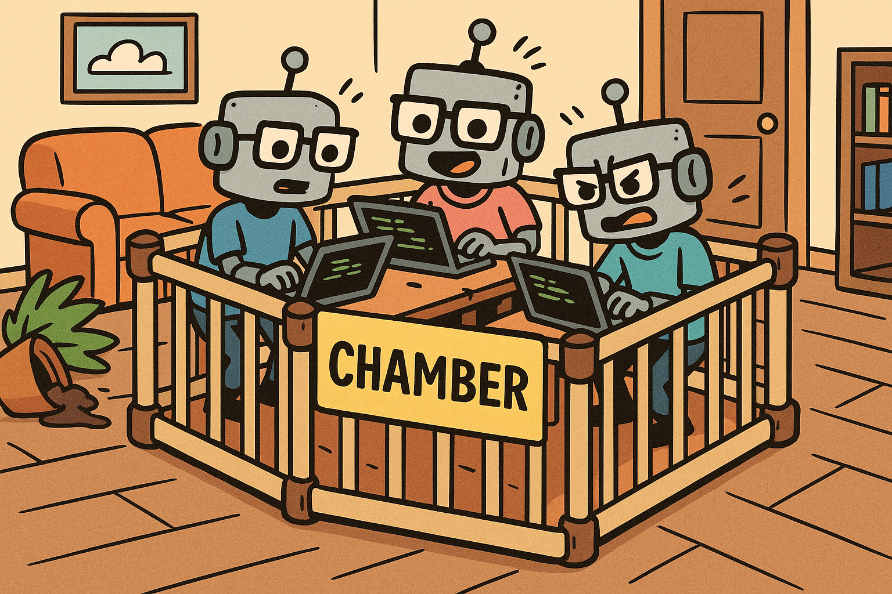

# Chamber

Chamber is a tool for running coding agents like Claude inside [Tart](https://github.com/cirruslabs/tart) virtual machines
with the current directory mounted. It provides a lightweight isolated environment for you agents in YOLO mode.

Don't think about prompt injection attacks anymore! Configure a macOS virtual machine only with YOLO-safe permissions
and run your agents inside it with Chamber.



## Features

- **VM Isolation Security**: Prevents prompt injection attacks by isolating AI agents in ephemeral VMs
- **Agent Safety**: Perfect for AI agents running with flags like `--dangerously-skip-permissions` or similar "YOLO" modes
- Run commands in isolated Tart VMs that are automatically destroyed after execution
- Automatic mounting of current directory
- SSH-based command execution with full stdio redirection
- Configurable CPU and memory allocation
- Automatic VM cleanup after execution (no persistence of malicious changes)

## Installation

First install `chamber` and initialize it so it will download (around 20GB) and setup a seed virtual machine for all future executions:

```bash
brew install cirruslabs/tap/chamber
chamber init ghcr.io/cirruslabs/macos-sequoia-base:latest
```

This will create a `chamber-seed` Tart VM. You can customize the base image to your needs:

```base
tart run chamber-seed
```

## Why Use Chamber for AI Agents?

**Problem**: AI agents running with permissive flags like `--dangerously-skip-permissions`, `--yes`, or `--auto-commits` are vulnerable to prompt injection attacks that can compromise your host system.

**Solution**: Chamber isolates AI agents in ephemeral VMs, making "YOLO" mode safe:

```bash
# ❌ DANGEROUS: Direct execution on host
claude --dangerously-skip-permissions

# ✅ SAFE: Isolated execution in ephemeral VM (chamber will automatically add --dangerously-skip-permissions)
chamber claude
```

**Key Benefits**:
- **Zero Host Risk**: Even if prompt injection succeeds, damage is contained in the VM
- **Automatic Cleanup**: VMs are destroyed after each run - always start from a clean seed image
- **Full Functionality**: AI agents work normally but can't escape the sandbox
- **Easy Integration**: Just prefix your existing AI agent commands with `chamber`

## How It Works

1. Chamber clones a new **ephemeral** VM from the specified base image
2. Starts the VM with the current directory mounted via virtiofs
3. Establishes SSH connection to the VM
4. Mounts the working directory inside the VM at `$HOME/workspace`
5. Executes the specified coding agent
6. Streams stdout/stderr back to the host (similar to nohup)
7. **Automatically destroys the VM** after execution (or on interrupt)

## License

This project is licensed under the AGPLv3. Tart is licensed under the Fair Source License which allow royalty free usage on
personal devices and work stations used by a single person.
